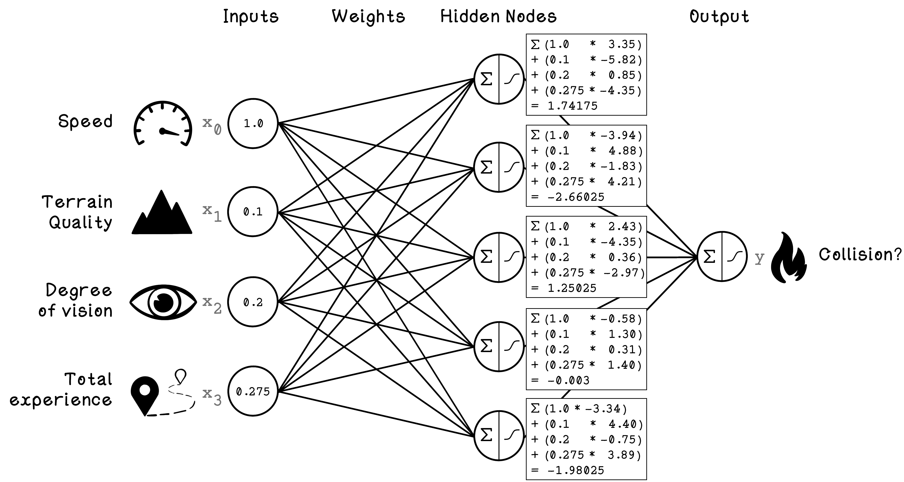
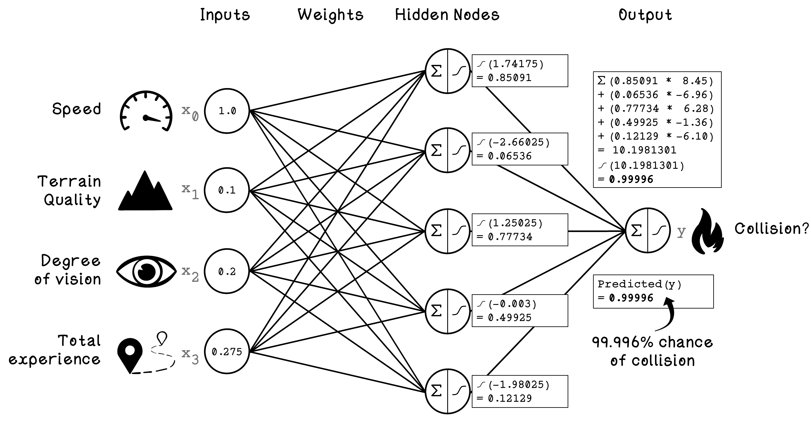
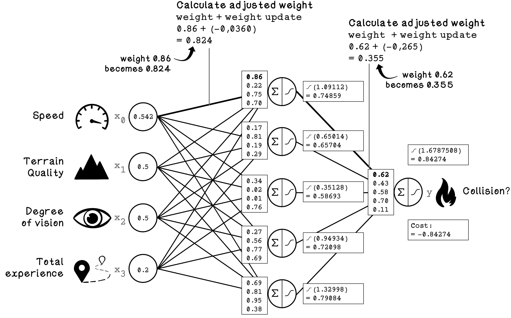
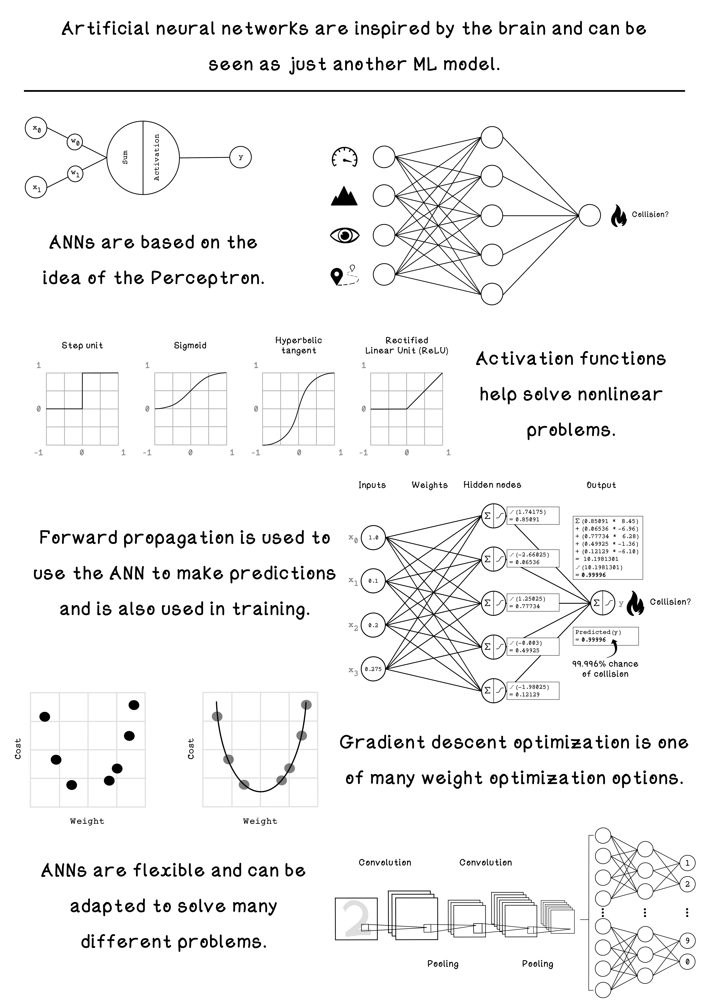

# Chapter 9 - Artificial Neural Networks
Artificial Neural Networks (ANNs) are powerful tools in the machine learning toolkit used in a variety of ways to accomplish different objectives like image recognition, natural language processing, and game playing among others. ANNs learn in a similar way to other machine learning algorithms – by using training data; however, they are most suited when data is unstructured and it’s difficult to find a good understanding of how features relate to each other. 

## Forward Propagation
The general flow for forward propagation includes the following steps:
1.	Input an example: Provide a single example from the dataset for which we want to predict the class.
2.	Multiply inputs and weights: Multiply every input by each weight of its connection to hidden nodes.
3.	Sum results of weighted inputs for each hidden node: Sum the results of the weighted inputs.
4.	Activation function for each hidden node: Apply an activation function on the result of the summed weighted inputs. 
5.	Sum results of weighted outputs of hidden nodes to the output node: Sum the weighted results of the activation function from all hidden nodes.
6.	Activation function for output node:  Apply an activation function on the result of the summed weighted hidden node results.

## Back Propagation
Phase A: Setup
1.	Define ANN architecture: This involves defining the input nodes, the output nodes, the number of hidden layers, the number of neurons in each hidden layer, the activation functions used, and more. We will dive into some of these details in the next section. For now, we will stick to the same ANN architecture that we have already used in the previous section.
2.	Initialize ANN weights: The weights in the ANN must be initialized to some value. There are various approaches to this, however, the key principle is that the weights will be constantly adjusted as the ANN learns from training examples but we need to start somewhere.
Phase B: Forward propagation: This is the same process that we covered in the previous section. The same calculations are carried out; however, the predicted output will be compared with the actual class for each example in the training set to train the network.
Phase C: Training
1.	Calculate cost: Following from forward propagation, the cost is the difference between the predicted output and the actual class for the examples in the training set. The cost is effectively determining how bad the ANN is at predicting the class of examples.
2.	Update weights in the ANN: The weights of the ANN are the only thing that can be adjusted by the network itself. The architecture and configurations that we defined in phase A doesn’t change during training the network. The weights are essentially encoding the “intelligence” of the network. Weights are adjusted to be larger or smaller which impacts the strength of the inputs. 
3.	Stopping condition: Training cannot happen indefinitely. Similarly to many of the algorithms explored in this book, a sensible stopping condition needs to be determined. If we have a large dataset, we might decide that we will use 500 examples in our training dataset over 1000 iterations to train the ANN. This means that the 500 examples will be passed through the network 1000 times and adjust the weights in every iteration. 

## Summary
